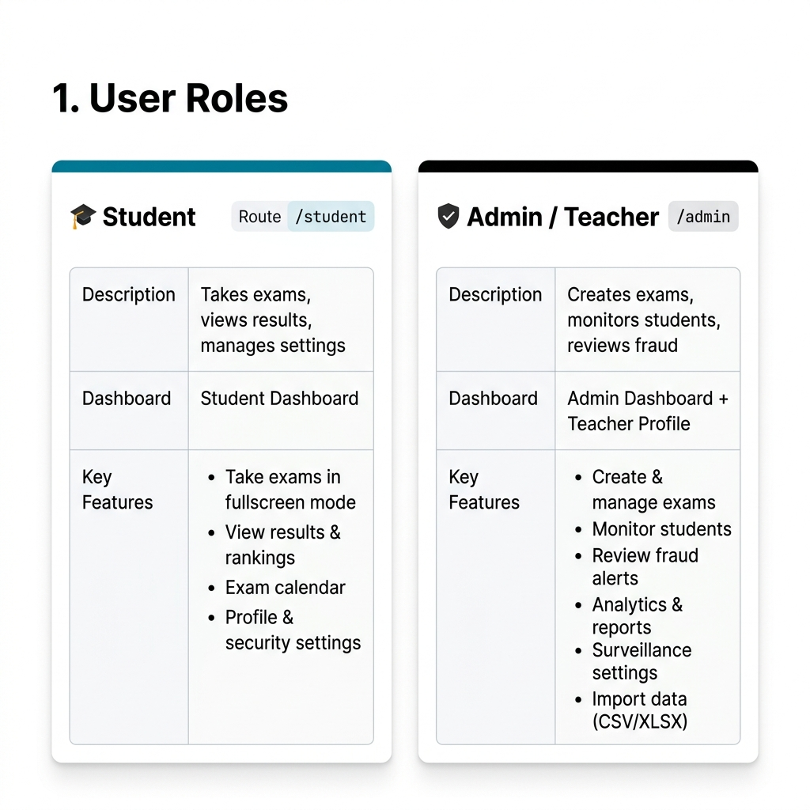
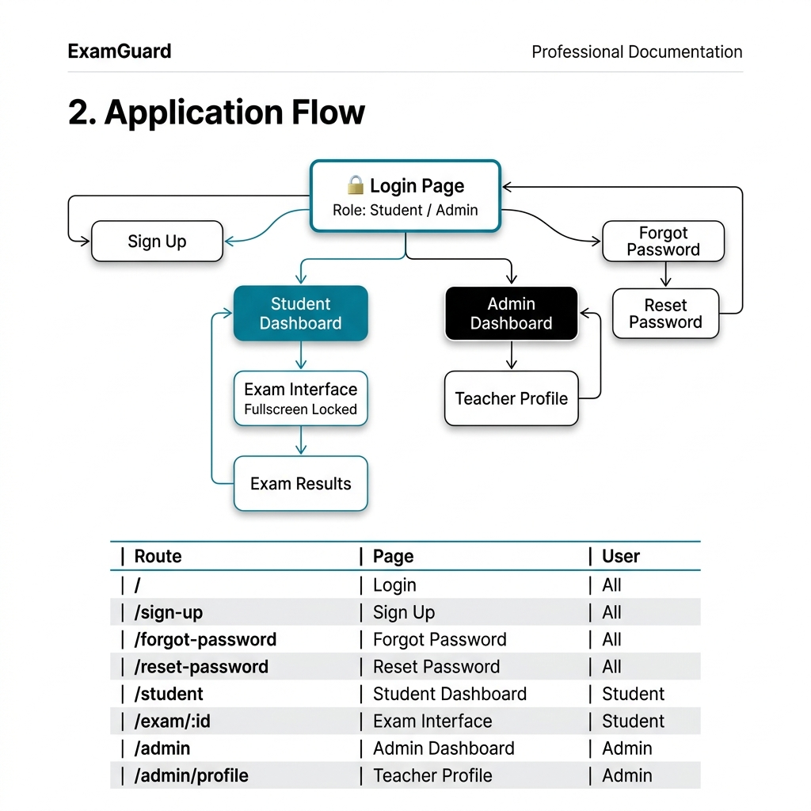
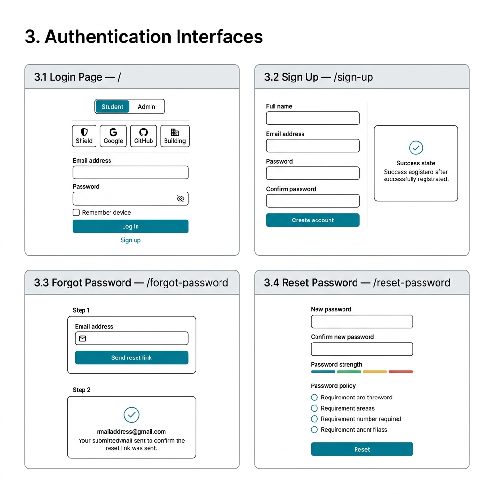
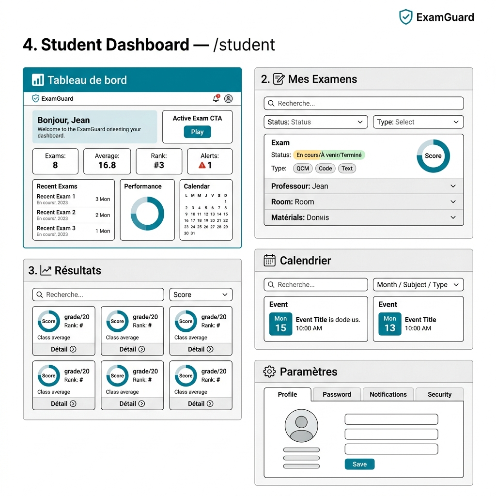
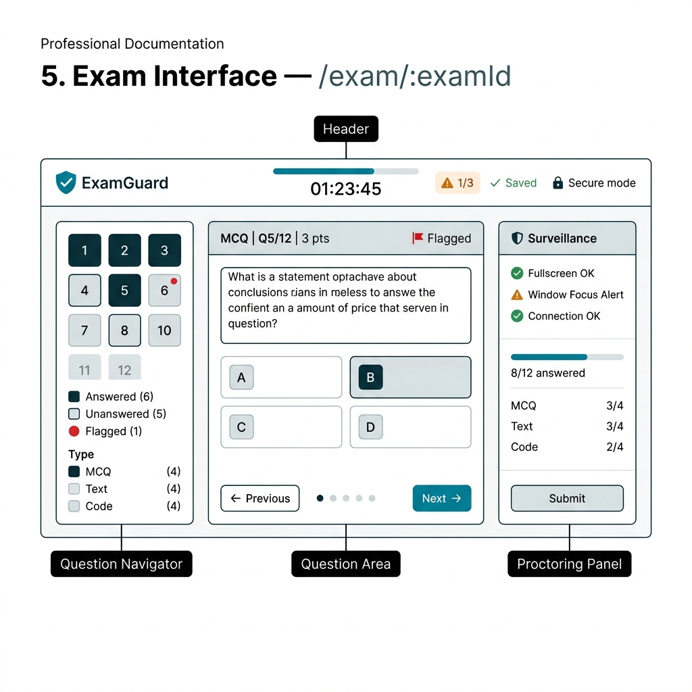
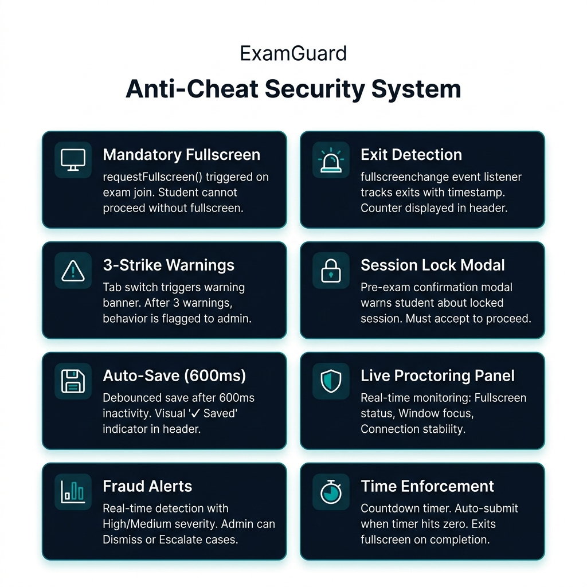
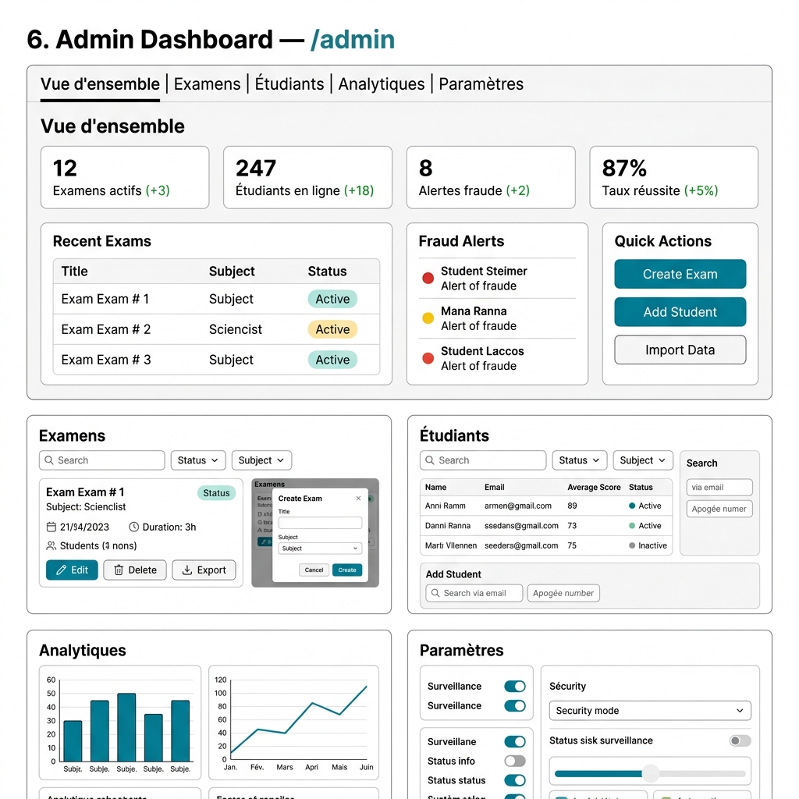
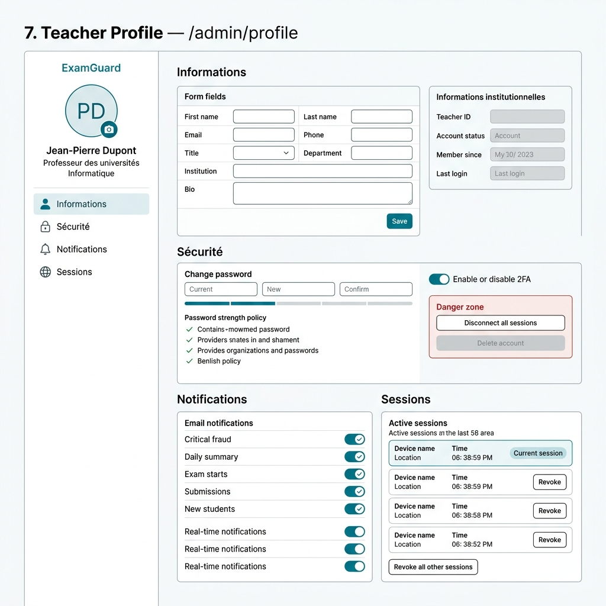
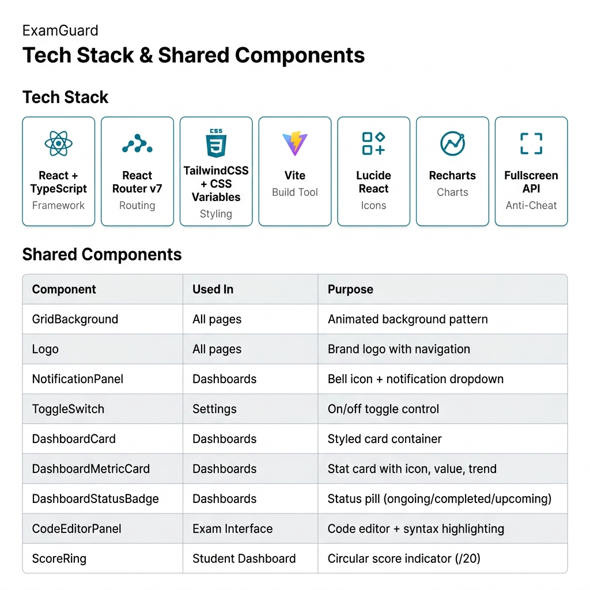

# ExamGuard — Application Overview

> **ExamGuard** is a secure online examination platform with real-time anti-cheating surveillance, built for universities and educational institutions.

---

## 1. User Roles

---

## 2. Application Flow

---

## 3. Authentication Interfaces

---

## 4. Student Dashboard — `/student`

---

## 5. Exam Interface — `/exam/:examId`

### Anti-Cheat Security System

---

## 6. Admin Dashboard — `/admin`

---

## 7. Teacher Profile — `/admin/profile`

---

## 8. Tech Stack & Shared Components

